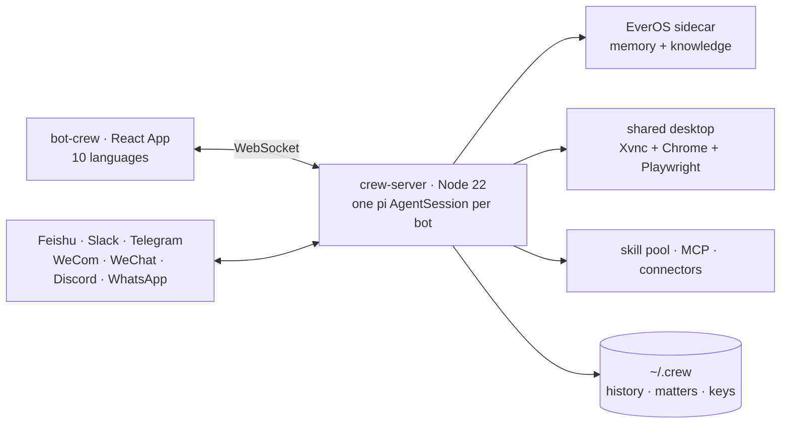

<div align="center">


# Steadbot

**Open-source AI coworkers that keep working after you close your laptop.**

English · [简体中文](README.zh-CN.md)

[](LICENSE)
[](https://github.com/arelchan/steadbot/actions/workflows/ci.yml)
[](https://nodejs.org)
[](https://github.com/arelchan/steadbot/stargazers)

</div>

Steadbot is a **self-hosted team of AI agents you message like colleagues**. Describe a job in one
sentence and a bot is born with a name, a brief and a face. Hand it work the way you hand work to a
coworker — say what you want, then go do something else. It files the job as a **matter**, works in
the background, and comes back only when it needs you to decide something.

The bots share **one Linux desktop with a real browser**, so they can use software that has no API.
They can reach you in **Feishu/Lark, Slack, Telegram, WeCom, WeChat, Discord and WhatsApp** — each bot
is its own bot account there, with its own credentials. And the whole team — chat history, matters,
memory, skills, keys — **moves onto a server that stays on** with one click, so work continues while
your laptop is shut.

There is no prompt box, no tool checklist and no per-conversation model picker. A bot writes its own
persona, mounts its own skills, installs its own dependencies, and registers its own bot account on
the IM platform by driving the platform's web console itself.

TypeScript on Node 22 and React 19. Every bot is an agent session from the [`pi`](https://www.npmjs.com/package/@earendil-works/pi-coding-agent)
SDK; skills are plain Markdown; long-term memory is a local [EverOS](https://pypi.org/project/everos/) sidecar. Apache-2.0.

## Quick start

```bash
git clone https://github.com/arelchan/steadbot.git
cd steadbot
bash steadbot install    # puts `steadbot` on your PATH (once)
steadbot                 # starts the server and the App, opens a browser
```

Needs **Node.js 22 or newer**. Nothing else — no Docker, no Python, no database.

With no model key configured it starts in **fake mode**: a scripted model walks the whole
message → matter → decision → done loop, so you can see what the product is before paying anyone.
To do real work, open **Settings › Models** and add one key.

Your data lives in `~/.crew`. Keys live in `~/.crew/config.json` (mode 600) **on the machine that runs
the bots** — never in this repository, never in the browser, never in a prompt.

```bash
steadbot status   # what is running
steadbot logs     # follow the server log
steadbot stop     # stop both
```

## What is actually different

**You hire a bot; you do not build one.** Creating an agent elsewhere means filling in a name, a
system prompt, a model, a temperature and a grid of tool checkboxes — which assumes you know what
prompt you want. You only know what job you want. Here one sentence produces the whole identity, and
from then on the bot edits itself: correct its tone, or give it the same kind of task three times, and
it rewrites its own persona or writes itself a manual. Every such change is one visible, revertible
event in the conversation.

**Every delegation leaves a receipt.** A bot's first act on any message is to open, update or close a
*matter* — four states, the same four piles you see in the sidebar. You never have to remember what
you asked for, and the bot never has to re-read the chat to find out where it got to. Recurring work
is the same thing on a timer.

**Interrupt any time.** Say something while a bot is mid-sentence and it stops, keeps the half
sentence on screen marked as interrupted, and re-decides. Tools already running are allowed to finish
(killing a half-written file is worse); everything queued behind them is dropped.

**They are colleagues, not subtasks.** A bot hands a whole job to another by @-mentioning it, or opens
a group when it needs several people and the result has to come back to one place. Everyone in a group
sees everything said there, but **only the mentioned bot wakes up** — so one message costs one bot's
tokens, not N, and everyone still knows what happened when their turn comes.

**They share one computer and you can watch it.** The bots' machine runs a desktop with one Chrome and
one set of logins. Ordinary web work goes through text snapshots — cheap and precise. Canvases,
designers, editors, drag-and-drop and desktop apps go to `operate(goal)`, which hands a whole small
goal to a vision model that looks at the screen, acts, and looks again. You see the live screen in the
workspace, and you can grab the mouse whenever it needs a login or a captcha.

**Your laptop is a signpost.** One click moves the whole home — history, matters, memory, skills,
credentials — to a Linux box you own, and the App follows it. Logins stay on your devices: a bot in the
cloud borrows the coding agents running on your computer when your computer is awake, and does without
them when it is not.

**A pool, not a feature list.** 227 skills from 33 upstream repositories ship with the product, and a
bot searches the pool instead of carrying all of it: it reads a manual once, and only mounts one when
the work keeps coming back. Skills are Markdown. MCP servers and OAuth connectors plug into the same
pool.

## Move the bots to a machine that stays on

From your own computer, against a fresh Ubuntu box with ssh:

```bash
bash crew-server/deploy/remote-install.sh root@YOUR-SERVER-IP            # plain HTTP on :5200
bash crew-server/deploy/remote-install.sh root@YOUR-SERVER-IP bots.example.com   # HTTPS via Caddy
```

It installs Docker if needed, builds, starts, and prints a pairing code. Paste that into
**Settings › Cloud computer** and the bots move there with everything they own. 2 vCPU / 4 GB is
enough; the browser and memory budgets size themselves to the machine. The same page moves them back.

Upgrades are `git` commits: the machine pulls the new commit itself, restarts in about 40 seconds, and
only rebuilds the image when the Dockerfile actually changed.

## Models

One row per job — chat, light, vision, GUI, image, web search, embedding, rerank — and each row is a
complete answer: which provider, whose key, which model. The provider catalogue, the credentials each
one needs and every model's context window and price come from `pi`'s model runtime (40 providers), not
from a list we maintain. Keys are per row; nothing is shared or borrowed between rows.

## Architecture



- [`crew-server/`](crew-server/) — the runtime: bots, matters, channels, desktop, memory, skills, upgrades.
- [`bot-crew/`](bot-crew/) — the App: React 19, no UI library, ten languages.
- [`DESIGN.md`](DESIGN.md) — why the product is shaped this way, judgement by judgement (Chinese).
- [`ARCHITECTURE.md`](ARCHITECTURE.md) — how the code is laid out (Chinese).
- [`AGENTS.md`](AGENTS.md) — orientation for coding agents working in this repository.

The directories are named `crew-server` and `bot-crew` for historical reasons; the data directory is
`~/.crew` and environment variables are `CREW_*`. Renaming them would break live deployments for no
benefit, so they stay.

## How is Steadbot different from other agent projects?

| | Steadbot | Agent frameworks (LangGraph, CrewAI, AutoGen) | Agent platforms (Dify, Flowise, Langflow) | Personal assistants (OpenClaw) |
| --- | --- | --- | --- | --- |
| What you write | one sentence | Python/TS orchestration code | a graph on a canvas | a config file |
| The unit | a colleague with a continuous history | a run | a workflow | one assistant |
| Multi-agent | @-mention and groups; only the mentioned bot wakes | orchestrator splits subtasks | branches in a graph | — |
| Async work | matters, decision cards, recurring tasks | you build it | you build it | chat |
| Computer use | shared desktop + `operate` for canvases | — | — | your own machine |
| Where it lives | your laptop, then one click to your server | your process | your server | your devices |

Steadbot is not a framework for building agents — it is the product an end user opens. If you want to
wire a graph yourself, use a framework. If you want to hand work to something that remembers you and
is still working tomorrow morning, this is that.

## FAQ

**Does it send my data anywhere?** Only to the model provider whose key you configured. There is no
telemetry, no account, no hosted backend in this repository.

**Do I need an OpenAI or Anthropic account?** You need one key from any provider `pi` supports —
OpenRouter, Anthropic, OpenAI, DeepSeek, Zhipu, DashScope, and 30-odd others.

**Can it run fully locally?** The server, the App and the memory engine run locally. Models run
wherever your key points; any OpenAI-compatible endpoint, including a local one, works.

**What happens when I close my laptop?** Nothing, if the bots have been moved to a server. If they are
still local, they stop until you open it again — the App says so in plain words.

**Is it production-ready?** It is pre-1.0 and we run it ourselves every day. Expect rough edges and
breaking changes; the upgrade path is a `git pull` and a restart.

**Can a bot really register its own Feishu app?** Yes — that is what the shared desktop is for. It
opens the platform console, creates the bot, enables the permissions and subscribes the events. You
only help with the login, and the secret is read off the page by the server: the model never sees it.

## Contributing

Issues and pull requests are welcome — [CONTRIBUTING.md](CONTRIBUTING.md) has the layout, the checks CI
runs, and the conventions worth knowing before a first patch. Security reports go to
[SECURITY.md](SECURITY.md), not to a public issue.

## License

[Apache-2.0](LICENSE). The bundled skill pool is redistributed from its upstream repositories under
their own licenses — see [THIRD_PARTY_NOTICES.md](THIRD_PARTY_NOTICES.md).
