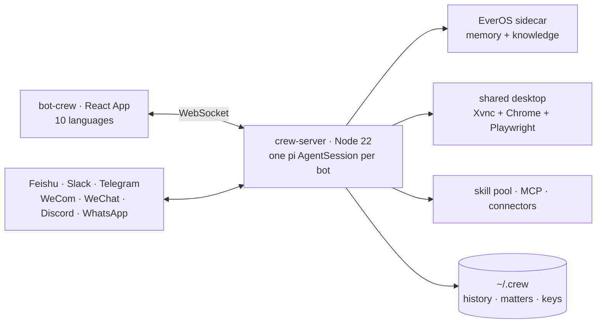

<div align="center">

<h1>Steadbot</h1>

**Open-source AI coworkers that keep working after you close your laptop.**

[English](README.md) · [简体中文](README.zh-CN.md)

[](LICENSE)
[](https://github.com/arelchan/steadbot/actions/workflows/ci.yml)
[](https://nodejs.org)
[](.github/CONTRIBUTING.md)
[](https://github.com/arelchan/steadbot/stargazers)

</div>

<br>


<br>

Steadbot is a **self-hosted team of AI agents you message like colleagues**. Describe a job in one
sentence and a bot is born with a name, a brief and a face. Hand it work the way you hand work to a
coworker — say what you want, then go do something else.

It files the job as a **matter**, works in the background, and comes back only when it needs you to
decide something. The bots share **one Linux desktop with a real browser**, so they can use software
that has no API. They appear as **their own bot accounts in Feishu/Lark, Slack, Telegram, WeCom,
WeChat, Discord and WhatsApp**. And the whole team — history, matters, memory, skills, keys — **moves
onto a server that stays on** in one click, so work continues while your laptop is shut.

There is no prompt box, no tool checklist and no per-conversation model picker. A bot writes its own
persona, mounts its own skills, installs its own dependencies, and registers its own bot account on a
messaging platform by driving that platform's web console itself.

## Quick start

```bash
git clone https://github.com/arelchan/steadbot.git
cd steadbot
bash steadbot install    # puts `steadbot` on your PATH (once)
steadbot                 # starts the server and the App, opens a browser
```

**Node.js 22 or newer** is the only requirement. No Docker, no Python, no database.

With no model key configured it starts in **fake mode**: a scripted model walks the whole
message → matter → decision → done loop, so you can see what the product is before paying anyone. To
do real work, open **Settings › Models** and add one key.

Your data lives in `~/.crew`. Keys live in `~/.crew/config.json` (mode 600) **on the machine that runs
the bots** — never in this repository, never in the browser, never in a prompt.

```bash
steadbot status   # what is running
steadbot logs     # follow the server log
steadbot stop     # stop both
```

## What makes it different

|  |  |
| --- | --- |
| **You hire a bot, you don't build one** | Elsewhere, creating an agent means a name, a system prompt, a model, a temperature and a grid of tool checkboxes — which assumes you know what prompt you want. You only know what job you want. One sentence produces the whole identity, and from then on the bot edits itself. |
| **Every delegation leaves a receipt** | A bot's first act on any message is to open, update or close a *matter*. You never have to remember what you asked for, and the bot never has to re-read the chat to find where it got to. |
| **Interrupt at any time** | Say something mid-sentence and it stops, keeps the half sentence on screen marked as interrupted, and re-decides. Tools already running finish; everything queued behind them is dropped. |
| **Colleagues, not subtasks** | A bot hands a whole job to another by @-mentioning it, or opens a group when several people are needed. Everyone in a group sees everything — but **only the mentioned bot wakes up**, so one message costs one bot's tokens, not N. |
| **They share a computer, and you watch it** | Ordinary web work goes through text snapshots: cheap and precise. Canvases, designers, editors and desktop apps go to `operate(goal)`, which hands a whole small goal to a model that looks at the screen, acts, and looks again. |
| **Your laptop is a signpost** | One click moves the home — history, matters, memory, skills, credentials — to a Linux box you own, and the App follows. Logins stay on your devices: a bot in the cloud borrows the coding agents on your computer while it is awake. |
| **A pool, not a feature list** | 227 skills from 33 upstream repositories ship with the product. A bot searches the pool rather than carrying all of it: it reads a manual once, and mounts one only when the work keeps coming back. |

<table>
<tr>
<td width="50%"><br><sub><b>The week.</b> Recurring work across the top, what needs you on the right.</sub></td>
<td width="50%"><br><sub><b>One bot, one continuous thread.</b> No sessions to start or clear.</sub></td>
</tr>
</table>

## Move the bots to a machine that stays on

From your own computer, against a fresh Ubuntu box with ssh:

```bash
bash crew-server/deploy/remote-install.sh root@YOUR-SERVER-IP            # plain HTTP on :5200
bash crew-server/deploy/remote-install.sh root@YOUR-SERVER-IP bots.example.com   # HTTPS via Caddy
```

It installs Docker if needed, builds, starts, and prints a pairing code. Paste that into
**Settings › Cloud computer** and the bots move there with everything they own. 2 vCPU / 4 GB is
enough; the browser and memory budgets size themselves to the machine. The same page moves them back.

Upgrades are `git` commits: the machine pulls the new commit itself and restarts in about 40 seconds,
rebuilding the image only when the Dockerfile actually changed.

## Models

One row per job — chat, light, vision, GUI, image, web search, embedding, rerank — and each row is a
complete answer: which provider, whose key, which model. The provider catalogue, the credentials each
one needs and every model's context window and price come from [`pi`](https://www.npmjs.com/package/@earendil-works/pi-coding-agent)'s
model runtime (40 providers), not from a list we maintain. Keys are per row; nothing is shared or
borrowed between rows.

## Architecture



| Where | What |
| --- | --- |
| [`crew-server/`](crew-server/) | the runtime: bots, matters, channels, desktop, memory, skills, upgrades |
| [`bot-crew/`](bot-crew/) | the App: React 19, no UI library, ten languages |
| [`docs/design.md`](docs/design.md) | why the product is shaped this way, judgement by judgement |
| [`docs/architecture.md`](docs/architecture.md) | how the code is laid out |
| [`AGENTS.md`](AGENTS.md) | orientation for coding agents working in this repository |

The two package directories are named `crew-server` and `bot-crew` for historical reasons, and the data
directory is `~/.crew`. Renaming them would break live deployments for no benefit, so they stay.

## How Steadbot compares

| | Steadbot | Agent frameworks<br/>(LangGraph, CrewAI, AutoGen) | Agent platforms<br/>(Dify, Flowise, Langflow) | Personal assistants<br/>(OpenClaw) |
| --- | --- | --- | --- | --- |
| What you write | one sentence | orchestration code | a graph on a canvas | a config file |
| The unit | a colleague with a continuous history | a run | a workflow | one assistant |
| Multi-agent | @-mention and groups; only the mentioned bot wakes | an orchestrator splits subtasks | branches in a graph | — |
| Async work | matters, decision cards, recurring tasks | you build it | you build it | chat |
| Computer use | shared desktop + `operate` for canvases | — | — | your own machine |
| Where it lives | your laptop, then one click to your server | your process | your server | your devices |

Steadbot is not a framework for building agents — it is the product an end user opens. To wire a graph
yourself, use a framework. To hand work to something that remembers you and is still working tomorrow
morning, this is that.

## FAQ

<details>
<summary><b>Does it send my data anywhere?</b></summary><br>

Only to the model provider whose key you configured. There is no telemetry, no account, and no hosted
backend in this repository.
</details>

<details>
<summary><b>Do I need an OpenAI or Anthropic account?</b></summary><br>

One key from any provider `pi` supports — OpenRouter, Anthropic, OpenAI, DeepSeek, Zhipu, DashScope and
about thirty others.
</details>

<details>
<summary><b>Can it run fully locally?</b></summary><br>

The server, the App and the memory engine run locally. Models run wherever your key points; any
OpenAI-compatible endpoint, including a local one, works.
</details>

<details>
<summary><b>What happens when I close my laptop?</b></summary><br>

Nothing, if the bots have been moved to a server. If they are still local they stop until you open it
again, and the App says so in plain words.
</details>

<details>
<summary><b>Is it production-ready?</b></summary><br>

It is pre-1.0 and we run it ourselves every day. Expect rough edges and breaking changes; the upgrade
path is a `git pull` and a restart.
</details>

<details>
<summary><b>Can a bot really register its own Feishu app?</b></summary><br>

Yes — that is what the shared desktop is for. It opens the platform console, creates the bot, enables
the permissions and subscribes the events. You only help with the login, and the secret is read off the
page by the server: the model never sees it.
</details>

## Contributing

Issues and pull requests are welcome. [CONTRIBUTING.md](.github/CONTRIBUTING.md) has the layout, the
checks CI runs and the conventions worth knowing before a first patch. Security reports go to
[SECURITY.md](.github/SECURITY.md), not to a public issue.

## License

[Apache-2.0](LICENSE). The bundled skill pool is redistributed from its upstream repositories under
their own licenses — see [third-party notices](docs/third-party-notices.md).
