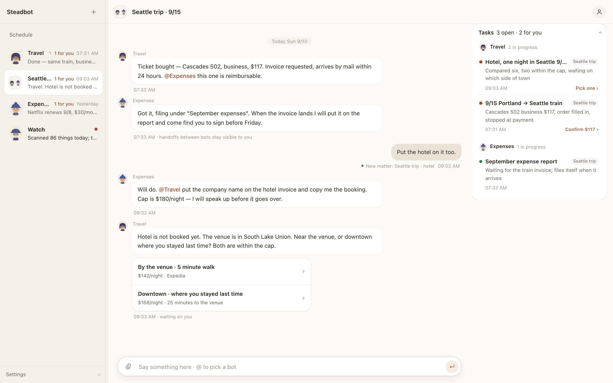
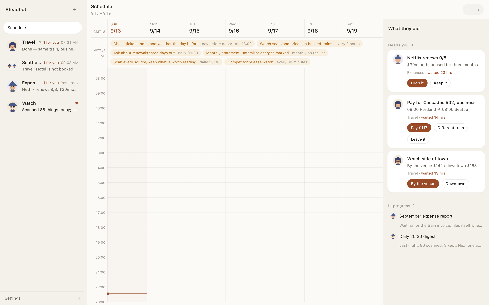
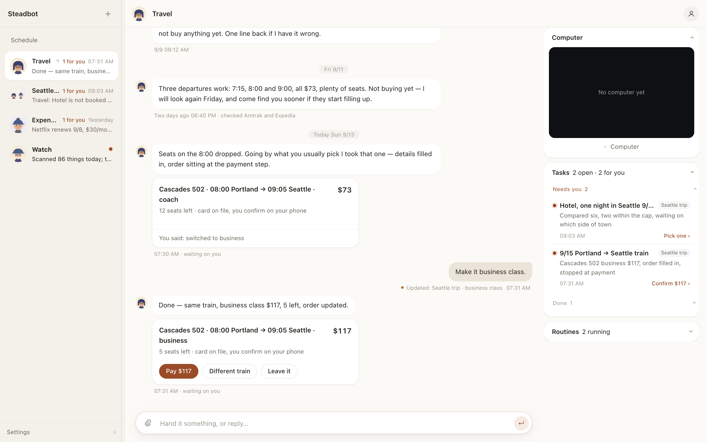

<div align="center">

# Steadbot

**开源的 AI 同事——你合上笔记本，它们还在干活。**

[English](README.md) · 简体中文

[](LICENSE)
[](https://github.com/arelchan/steadbot/actions/workflows/ci.yml)
[](https://nodejs.org)
[](.github/CONTRIBUTING.md)
[](https://github.com/arelchan/steadbot/stargazers)

</div>

<br>



<br>

Steadbot 是一套**自己部署的 AI 同事**，用起来像通信软件，不像 agent 调试台。说一句要办的事，
一个 bot 就出生了：名字、简介、职责、头像一次写全。之后你像交代同事一样交代它——说完就走。
它先把这件事落成一条**事项**，在后台干，只有需要你拍板时才回来找你。

所有 bot 共用**一台带真浏览器的 Linux 电脑**，所以没有 API 的软件它们照样能用。它们能出现在
**飞书、Slack、Telegram、企业微信、微信、Discord、WhatsApp** 里——每个 bot 在那边是一个独立的
机器人、一套自己的凭据。整个团队——聊天记录、事项、记忆、技能、密钥——**一键搬到一台常开的机器上**，
你的电脑关了，活照样在推进。

这里没有 prompt 输入框，没有工具勾选表，没有每轮对话选模型。bot 自己写人设、自己挂技能、
自己装依赖，连去飞书后台建机器人这件事，也是它自己开着浏览器点出来的。

TypeScript + Node 22 + React 19。每个 bot 是一个 [`pi`](https://www.npmjs.com/package/@earendil-works/pi-coding-agent)
SDK 的 agent session；技能就是 Markdown；长期记忆是本机跑的 [EverOS](https://pypi.org/project/everos/) sidecar。Apache-2.0。

## 跑起来

```bash
git clone https://github.com/arelchan/steadbot.git
cd steadbot
bash steadbot install    # 把 steadbot 装进 PATH（只用做一次）
steadbot                 # 起后端 + App，并打开浏览器
```

只要 **Node.js 22 以上**。不用 Docker，不用 Python，不用数据库。

没配模型密钥时自动进 **fake 模式**：一个脚本化的假模型把「消息 → 事项 → 拍板 → 完成」整条链路
跑通，所以你可以先看清楚这是个什么产品，再决定给谁付钱。要真干活，打开**设置 › 模型**填一把钥匙。

数据在 `~/.crew`。钥匙在 `~/.crew/config.json`（权限 600），**存在跑 bot 的那台机器上**——
不进仓库、不进浏览器、不进提示词。

## 到底有什么不一样

**你是雇一个 bot，不是搭一个 bot。** 别处建 agent 要填名字、system prompt、模型、温度、
再勾二十个工具——这套表格的前提是你知道自己要什么 prompt，可你只知道自己要办什么事。
这里一句话生出完整身份，之后它自己改自己：你纠正了语气，或者同一类活来了三次，
它就重写自己的人设、给自己写一本手册。每次改动在对话里留一条看得见、能回滚的记录。

**每一次委托都有凭证。** bot 收到任何消息，第一件事是开、改或关一条**事项**——只有四态，
就是你在侧栏看到的那四叠。你不必记得自己交代过什么，它也不必翻聊天记录找自己干到哪了。
例行任务就是同一件事加一张时间表。

**随时插话。** 它正在说话时你发一句，它立刻停，半句留在屏幕上标「被打断」，然后重新判断。
已经在跑的工具让它跑完（写到一半杀掉更糟），排在后面还没开始的作废。

**bot 之间是同事，不是子任务。** 整件事交出去就 @ 对方；要几个人凑齐才交付得了，就开一个群。
群里说的话所有人都收得到，但**只有被 @ 的那个会醒**——所以一条消息只烧一个 bot 的钱，
而每个人下次开口时都知道群里发生过什么。

**它们共用一台电脑，你看得见。** 那台机器上有一个桌面、一个 Chrome、一套登录态。普通网页走
文字快照，便宜又准；画板、设计器、剪辑、拖拽、桌面软件交给 `operate(goal)`——把一个完整的小目标
整个交出去，由一个能看屏幕的模型看一眼、动一下、再看一眼。屏幕在工作区里直播，要登录、要验证码时
你随时可以抢过鼠标。

**你的电脑只是路牌。** 一键把整个家——记录、事项、记忆、技能、凭据——搬到你自己的 Linux 机器上，
App 自动跟过去。登录态不搬：云上的 bot 借用你电脑上开着的编码 agent，你电脑睡了就借不到，
它自己会说。

**一条池子，不是一张功能表。** 产品自带 227 本手册，来自 33 个上游仓库。bot 不是全背在身上，
而是去池子里搜：读一次就用完的不装，同类活反复来的才装在身上。手册就是 Markdown。
MCP 服务和 OAuth 连接器进同一条池子。

<table>
<tr>
<td width="50%"><br><sub><b>一周。</b>例行任务在顶上，要你拍板的在右边。</sub></td>
<td width="50%"><br><sub><b>一个 bot 一条连续的对话。</b>没有会话要开、要清。</sub></td>
</tr>
</table>

## 搬到一台常开的机器上

在你自己的电脑上，对一台装好 Ubuntu、能 ssh 的机器：

```bash
bash crew-server/deploy/remote-install.sh root@服务器IP            # 明文 HTTP，端口 5200
bash crew-server/deploy/remote-install.sh root@服务器IP bots.example.com   # 走 Caddy 配 HTTPS
```

脚本会按需装 Docker、构建、启动，最后打印一串连接码。把它贴进**设置 › 云电脑**，
bot 们就带着全部家当搬过去了。2 核 4G 够用，浏览器和记忆的内存预算按机器大小自己算。
同一页也能把它们搬回来。

升级就是 git 提交：机器自己拉代码，四十秒重启，只有 Dockerfile 真变了才重建镜像。

## 模型

一行一件事——对话 / 轻模型 / 看图 / 操作屏幕 / 画图 / 联网搜索 / 向量 / 重排——每一行是一个完整的
答案：哪一家、谁的钥匙、哪个模型。provider 目录、每家要什么凭据、每个模型的上下文和价格，
都来自 `pi` 的 model runtime（40 家），不是我们维护的清单。钥匙按行存，行与行之间不借。

## 代码在哪

- [`crew-server/`](crew-server/) —— 运行时：bot、事项、渠道、电脑、记忆、技能、升级。
- [`bot-crew/`](bot-crew/) —— App：React 19，没有 UI 库，十种语言。
- [`DESIGN.md`](docs/design.md) —— 产品为什么长这样，一条判断一条设计。
- [`ARCHITECTURE.md`](docs/architecture.md) —— 代码该怎么摆。
- [`AGENTS.md`](AGENTS.md) —— 给在这个仓库里干活的编码 agent 看的。

目录仍叫 `crew-server` 和 `bot-crew`，数据目录仍是 `~/.crew`，环境变量仍是 `CREW_*`——
改名会弄坏线上部署，而收益是零，所以留着。

## 常见问题

**我的数据会被传到哪儿去？** 只会传给你自己配的那家模型服务。这个仓库里没有遥测、没有账号、
没有任何我们的后端。

**一定要 OpenAI 或 Anthropic 的账号吗？** 任何 `pi` 支持的一家就行——OpenRouter、Anthropic、
OpenAI、DeepSeek、智谱、百炼，还有三十来家。

**能完全本地跑吗？** 后端、App、记忆引擎都在本地。模型在你钥匙指向的地方，
任何 OpenAI 兼容的地址都行，包括本地的。

**能用在生产上吗？** 还没到 1.0，我们自己每天在用。会有毛刺，也会有破坏性改动；
升级路径就是 `git pull` 加重启。

## 参与

欢迎 issue 和 PR，动手前看一眼 [CONTRIBUTING.md](.github/CONTRIBUTING.md)。
安全问题请走 [SECURITY.md](.github/SECURITY.md)，不要开公开 issue。

## 许可

[Apache-2.0](LICENSE)。自带的技能池是从各自上游原样搬来的，按它们自己的许可，
清单见 [THIRD_PARTY_NOTICES.md](docs/third-party-notices.md)。
