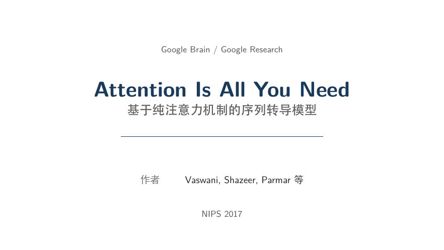
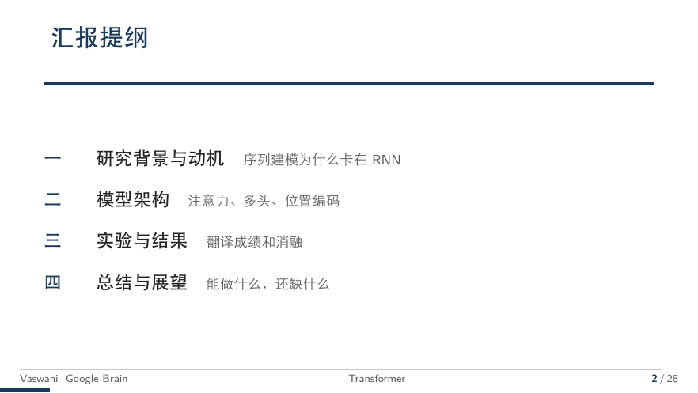
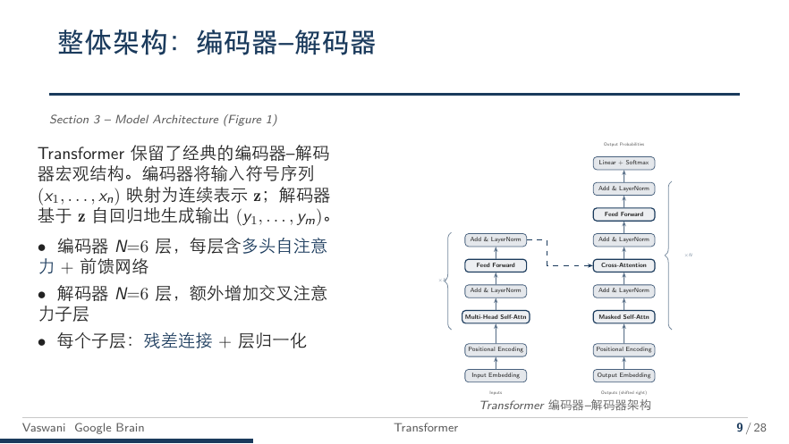
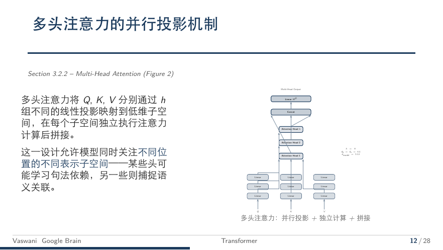
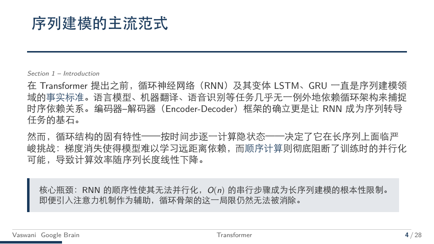
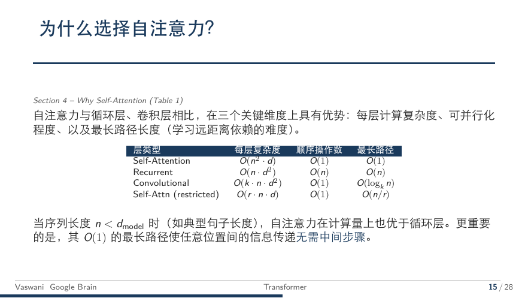
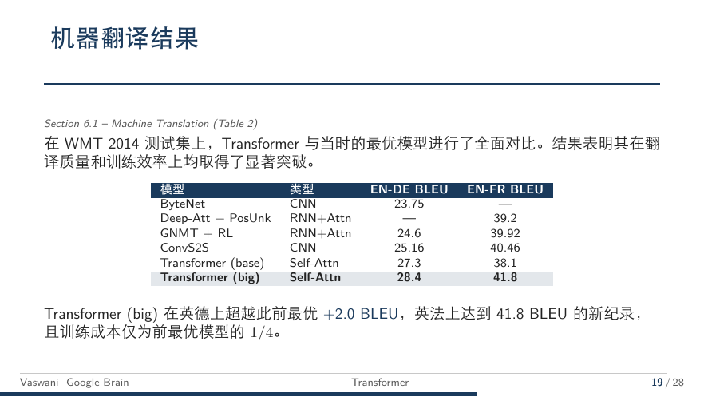

<div align="center">
  
  
  <br><br>

  # Beamer Academic

  **Drop your thesis in, get defense slides out.**<br>
  **论文丢进来，答辩 PPT 自动生成。**

  AI Skill for [Claude Code](https://docs.anthropic.com/en/docs/claude-code) / [Codex](https://openai.com/index/codex/) · 13 Layouts · 5 Color Schemes · Works Out of the Box

  <br>

  [](https://github.com/Faust-Donf/beamer-academic/releases)
  [](https://github.com/Faust-Donf/beamer-academic/stargazers)
  [](LICENSE)
  [](https://socialistic.ai/zh/skill/beamer-academic-ace6dc?utm_source=github&utm_medium=readme&utm_campaign=20260604-ai-deck-report-toolsmiths&utm_content=badge)

  <br>

  [Quick Start](#-quick-start) · [Gallery](#-gallery) · [Layouts](#-layouts) · [Example](examples/transformer/) · [Customization](#-customization)

  <br>
</div>

---

> [!TIP]
> **EN** — Give it your thesis (PDF / Word / LaTeX), say *"make my defense slides"*, and get a **ready-to-present** Beamer PDF. No LaTeX knowledge required.
>
> **中文** — 把论文扔进来，说"帮我做答辩PPT"，就能拿到一份可以直接上台答辩的 Beamer 幻灯片。不需要会 LaTeX，不需要手动排版。

<br>

## ✨ What It Does / 这是什么

An AI Skill (plugin) for Claude Code / Codex that turns your thesis into professional Beamer slides through a fully automated pipeline:

一个 Claude Code / Codex 的 AI Skill（插件），通过全自动管道将论文转化为专业 Beamer 幻灯片：

```
Thesis / 论文  →  Extract / 素材提取  →  Outline / 大纲  →  Generate / 内容生成  →  PDF
```

You only confirm the outline. Everything else is automatic.  
你只需确认大纲，其余全部自动完成。

<br>

## 🖼️ Gallery / 效果展示

Auto-generated from *Attention Is All You Need* → [full source & PDF](examples/transformer/)

以下为从 *Attention Is All You Need* 自动生成的示例 → [完整源码和 PDF](examples/transformer/)

<table>
  <tr>
    <td align="center"><strong>Cover / 封面</strong></td>
    <td align="center"><strong>TOC / 目录</strong></td>
  </tr>
  <tr>
    <td></td>
    <td></td>
  </tr>
  <tr>
    <td align="center"><strong>TikZ Architecture / TikZ 架构图</strong></td>
    <td align="center"><strong>TikZ Multi-Head Attention / 多头注意力</strong></td>
  </tr>
  <tr>
    <td></td>
    <td></td>
  </tr>
  <tr>
    <td align="center"><strong>Text + Formula / 段落+公式</strong></td>
    <td align="center"><strong>Table + Conclusion / 表格+结论</strong></td>
  </tr>
  <tr>
    <td></td>
    <td></td>
  </tr>
  <tr>
    <td align="center"><strong>Full-page Figure / 满版图</strong></td>
    <td align="center"><strong>Acknowledgement / 致谢</strong></td>
  </tr>
  <tr>
    <td></td>
    <td></td>
  </tr>
</table>

<br>

## 🎯 Features / 特性

<table>
  <tr>
    <td width="60" align="center">🚀</td>
    <td><strong>One-command generation / 一键生成</strong><br>Provide thesis (.tex/.docx/.pdf), everything auto<br>提供论文，全流程自动</td>
  </tr>
  <tr>
    <td align="center">📐</td>
    <td><strong>13 page layouts / 13 种版式</strong><br>Cover, TOC, section divider, text-only, text+image, formula, table, full-image, conclusion, transition, list, thanks<br>封面、目录、分隔页、纯文段、左文右图、公式、表格、满版图、结论框、过渡、列表、致谢</td>
  </tr>
  <tr>
    <td align="center">✏️</td>
    <td><strong>Interactive editing / 交互修改</strong><br>Modify by page number after generation, no LaTeX needed<br>按页码精准修改，无需懂 LaTeX</td>
  </tr>
  <tr>
    <td align="center">🎨</td>
    <td><strong>5 color schemes / 5 种配色</strong><br>Blue / Red / Green / Purple / Teal — one-line config change<br>蓝/红/绿/紫/青，一行配置切换</td>
  </tr>
  <tr>
    <td align="center">🎓</td>
    <td><strong>Multi-scenario / 多场景</strong><br>Thesis defense, proposal, academic conference<br>毕业答辩、开题报告、学术会议</td>
  </tr>
  <tr>
    <td align="center">🔧</td>
    <td><strong>Auto error-fix / 自动纠错</strong><br>Detects and fixes overflow, overlap, and layout issues<br>自动检测图文重叠、溢出等排版问题并修复</td>
  </tr>
</table>

<br>

## 🚀 Quick Start / 快速开始

### Installation / 安装

```bash
# Claude Code
git clone https://github.com/Faust-Donf/beamer-academic.git ~/.claude/skills/beamer-academic

# Codex
git clone https://github.com/Faust-Donf/beamer-academic.git ~/.codex/skills/beamer-academic
```

### Prerequisites / 前置依赖

<details>
<summary><kbd>LaTeX Installation / LaTeX 安装</kbd> (click to expand / 点击展开)</summary>

<br>

```bash
# macOS
brew install --cask mactex-no-gui

# Ubuntu / Debian
sudo apt install texlive-xetex texlive-lang-chinese texlive-fonts-recommended

# Fedora
sudo dnf install texlive-xetex texlive-xecjk

# Windows (WSL)
sudo apt install texlive-xetex texlive-lang-chinese
```

</details>

> [!NOTE]
> No LaTeX installed? The Skill will guide you through setup.  
> 没装 LaTeX？Skill 会引导你配置环境。

### Input Format / 论文输入格式

| Format | | Notes |
|:--|:--:|:--|
| `.tex` | ⭐⭐⭐ | **Best / 首选** — figures & formulas reused directly / 图片公式直接复用 |
| `.docx` | ⭐⭐⭐ | **Great / 推荐** — full image quality / 图片质量完整 |
| `.pdf` | ⚠️ | **Not recommended / 不推荐** — quality loss / 有损耗 |

> [!IMPORTANT]
> If you have the source file (Word / LaTeX), **use that instead of PDF**.  
> 如果有 Word 或 LaTeX 源文件，**请优先使用**，不要转成 PDF。

### Usage / 使用

```bash
mkdir my-defense && cp thesis.docx my-defense/ && cd my-defense
```

Then say / 然后说:

```
"Make my defense slides"  or  "帮我做答辩PPT"
```

Or type / 或输入: `/beamer-academic`

The Skill asks a few questions (university, name, advisor, color), then runs the full pipeline automatically.  
Skill 会问几个基本信息（学校、姓名、导师、配色），然后全自动跑完。

<br>

## ⚙️ How It Works / 工作流程

```
Thesis / 论文 ──┐
                ▼
     ┌──────────────────┐
     │  Extract / 素材   │  Figures, tables, formulas, structure
     └────────┬─────────┘
              ▼
     ┌──────────────────┐
     │  Outline / 大纲   │  Auto-assigns 13 layout types
     └────────┬─────────┘
              ▼
     ┌──────────────────┐
     │  ★ Confirm / 确认 │  ← Only manual step (say "ok")
     └────────┬─────────┘
              ▼
     ┌──────────────────┐
     │  Generate / 生成  │  Fills layout templates page by page
     └────────┬─────────┘
              ▼
     ┌──────────────────┐
     │  Compile / 编译   │  xelatex × 2
     └────────┬─────────┘
              ▼
     ┌──────────────────┐
     │  Edit Loop / 修改 │  "P7 too dense" → auto-split & recompile
     └──────────────────┘
```

<br>

## 📐 Layouts / 版式库

13 battle-tested academic layouts / 13 种经过实战验证的学术版式:

| Layout / 版式 | File | When / 何时用 |
|:--|:--|:--|
| Cover / 封面 | `cover.tex` | First page / 第一页 |
| TOC / 目录 | `toc.tex` | Second page / 第二页 |
| Section Divider / 章节分隔 | `section-divider.tex` | Chapter start / 每章开头 |
| Text Only / 纯文段 | `text-only.tex` | Background, motivation / 背景、动机 |
| Text + Image Right / 左文右图 | `text-left-image-right.tex` | Text-driven / 文字为主 |
| Image + Text Right / 左图右文 | `image-left-text-right.tex` | Image-driven / 图为主 |
| Formula / 公式 | `formula.tex` | Equations / 模型定义 |
| Table / 表格 | `table.tex` | Results / 实验结果 |
| Full Image / 满版图 | `full-image.tex` | Large diagrams / 大图 |
| Conclusion / 结论框 | `conclusion-box.tex` | Key findings / 核心结论 |
| Transition / 过渡 | `transition.tex` | Bridge / 承上启下 |
| List / 列表 | `list.tex` | Contributions / 创新点 |
| Thanks / 致谢 | `thanks.tex` | Final page / 最后一页 |

See [`layouts/_registry.yaml`](layouts/_registry.yaml) for detailed layout definitions.

<br>

## 🎨 Color Schemes / 配色方案

```yaml
# assets/config.yaml
color_scheme: "blue"   # blue | red | green | purple | teal
```

| Scheme / 方案 | Color / 色值 | For / 推荐 |
|:--|:--|:--|
| 🔵 Blue / 蓝 | `rgb(26, 58, 92)` | STEM / 理工科 (default) |
| 🔴 Red / 红 | `rgb(139, 0, 0)` | Humanities / 人文社科 |
| 🟢 Green / 绿 | `rgb(0, 100, 60)` | Agriculture, Env / 农林环境 |
| 🟣 Purple / 紫 | `rgb(75, 0, 110)` | Arts / 文科艺术 |
| 🔷 Teal / 青 | `rgb(0, 80, 100)` | Medicine / 医学海洋 |

<br>

## 🛠️ Customization / 自定义

### Your University / 换成自己学校

```yaml
# assets/config.yaml
institution:
  name: "Your University / 你的大学"
  department: "Your Department / 你的学院"
  logo: "your-logo.png"
  gate_image: "your-gate.png"   # Thanks page (optional / 可选)

color_scheme: "red"
```

### Add New Layouts / 添加新版式

1. Add a layout section in `references/layouts.md`
2. Register in `references/layout-registry.yaml` (define `when` and `slots`)
3. Done / 完成

<br>

## 🤔 Why Beamer? / 为什么用 Beamer？

Many AI tools generate slides as images. This project uses LaTeX/Beamer — a deliberate choice validated through real defenses.

市面上不少 AI PPT 工具走图片生成路线。本项目选择 LaTeX/Beamer，是经过真实答辩验证的选择。

| Dimension / 维度 | Beamer Academic | Image-based / 图片生成 |
|:--|:--|:--|
| **Academic safety / 学术安全** | Template-constrained, advisor-approved style<br>模板约束，不会"一看就是AI" | Unpredictable style<br>视觉不确定 |
| **Accuracy / 准确性** | Extracts original figures & formulas<br>原图原公式 | May contain errors<br>可能有误 |
| **Editability / 可编辑** | Full `.tex` source control<br>源码完全可控 | Hard to modify locally<br>改动困难 |
| **Reproducibility / 可复现** | Same `.tex` = same PDF<br>永远一致 | Different each time<br>每次不同 |

### Best For / 适合谁

| ✅ | ❌ |
|:--|:--|
| Thesis defense / 毕业答辩 | Business pitches / 商业路演 |
| Proposal defense / 开题报告 | Product launches / 产品发布 |
| Conference talks / 学术会议 | Creative presentations / 创意设计 |
| Lab meetings / 组会汇报 | |

<br>

## 📁 Project Structure / 项目结构

```
beamer-academic/
├── SKILL.md                    # Main skill file (AI reads this)
├── references/
│   ├── layouts.md              # 13 layout LaTeX skeletons
│   ├── layout-registry.yaml   # Layout selection rules
│   └── tex-header.md          # .tex preamble template
├── assets/
│   ├── beamerthemeAcademic.sty # Beamer theme file
│   └── config.yaml            # User config template
├── scripts/
│   ├── compile.sh             # Compilation script
│   └── extract_figures.py     # Figure extraction (PDF/DOCX/LaTeX)
├── examples/
│   └── transformer/           # Full working example (26 pages)
├── docs/                      # Screenshot gallery
└── README.md
```

<br>

## 📈 Star History

<p align="center">
  <a href="https://star-history.com/#Faust-Donf/beamer-academic&Date">
    
  </a>
</p>

<br>

## 🤝 Contributing

Contributions welcome! See [CONTRIBUTING.md](CONTRIBUTING.md).

欢迎贡献！请参阅 [CONTRIBUTING.md](CONTRIBUTING.md)。

## 👤 Author / 作者

**Faustus** · [Xiaohongshu / 小红书](https://xhslink.com/m/2JQ3fmTu6dz)

## 📄 License

[MIT](LICENSE)
