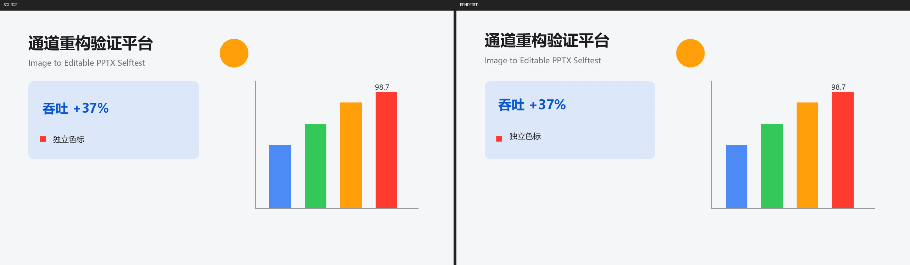

# img2ppt-lite

**把一张 PPT 效果图（PNG/JPG）还原成高保真、可编辑的 PPTX。**

Turn a slide mockup image (e.g. generated by GPT-image / Midjourney / any design tool) into an editable PowerPoint file: native text boxes + semantically-split draggable sprites + inpainted clean background. Built as an agent skill — the executing AI (Claude Code / Codex / any CLI agent with vision) acts as the VLM, deterministic Python scripts do everything else.



*左：合成样张源图 · 右：管线重建后由 PowerPoint 渲染回的图（文字全部为原生可编辑文本框，图表/图标为独立贴图）*

## 它解决什么问题

AI 出图工具能生成非常漂亮的 PPT 效果图，但那只是一张图片。想拿它当真正的工作底稿，你需要：

- **文字可编辑**——改标题、改数据是最高频操作；
- **元素可拖拽**——每个图标、图表、色块都是独立对象，能单独移动缩放；
- **视觉尽量 1:1**——还原完的页面和效果图肉眼几乎一致。

传统"图转 PPT"路线要么把整页塞成一张图（完全不可编辑），要么全原生重建（图标丑、收敛循环极慢）。img2ppt-lite 走中间路线，并把速度做到了**单页 3-5 分钟**（脚本部分约 40-60 秒）。

## 核心设计

```
可编辑 PPTX = 干净底图 (inpaint 去前景)
            + 语义元素贴图 (每个图标/图表一张独立 picture，可拖拽)
            + 原生文本框 (PIL 墨水高度反解字号，可编辑)
            + 纯色矩形原生化 (KPI 条/按钮/色块 → 可改色的原生 shape)
```

三个反直觉的关键决策：

1. **视觉一致性的最大敌人恰恰是"原生重建"。** 从原图裁出来的贴图天然 100% 一致；会漂的只有文本层——而文本字号可以用 PIL 按墨水高度离线反解，**不需要"渲染→对比→调整"的收敛循环**。这是比前代管线快一个量级的根本原因。
2. **执行 agent 自身就是 VLM。** 不调外部视觉 API：agent 看图产出一份 `elements.json`（文本/色块/图形的语义标注），脚本吃 JSON 确定性完成其余一切。LLM 参与固定 2 次（标注 + 终检），零额外 token 成本。
3. **测量代替猜测。** 字号、文字颜色、卡片填充色、渐变、行首 marker 全部从像素实测，agent 只负责语义；每个测量器都经过阳性+阴性用例双验。

## 环境要求

- Windows（PowerPoint COM 用于渲染回读验证；**没有 PowerPoint 也能出 PPTX**，只是跳过渲染验证）
- Python 3.10+

```bash
pip install -r requirements.txt
```

装好后先跑自检（生成合成样张走全链路，含 marker 正/负回归用例）：

```bash
python scripts/pipeline.py --selftest
```

## 使用方式

### 作为 agent skill（推荐）

把本仓库放进你的 agent skill 目录（如 Claude Code 的 `~/.claude/skills/img2ppt-lite/`），agent 会按 `SKILL.md` 的 5 步工作流执行：

```
1. pipeline.py --run <run> --seed     # OCR 冷启动，产出待审阅的文本骨架
2. [agent 看图] 校对 seed、补图形/色块标注 → elements.json
3. pipeline.py --run <run>            # OCR校准 → 切图 → 装配 → COM 渲染验收
4. [agent 看图] 对比 compare.png，必要时改 JSON 秒级重跑
5. 交付 pptx + 验收报告（修补硬上限 2 轮，禁无限迭代）
```

### 手动使用

不用 agent 也可以：自己按 `SKILL.md` 里的 schema 手写 `elements.json`（`--seed` 会帮你生成大部分文本条目），然后跑 `pipeline.py --run <目录>`。

### 工作目录

默认 `~/ppt-lite/runs/<日期>-<名称>/`，环境变量 `IMG2PPT_RUNS` 可改。每个 run 目录自包含：源图、标注、切图资产、产物、渲染对比图，改 JSON 重跑幂等。

## 脚本一览

| 脚本 | 职责 |
|------|------|
| `pipeline.py` | 编排入口 + `--seed` OCR 骨架 + `--selftest` 全链路自检 |
| `ocr_refine.py` | RapidOCR 本地校准文本 bbox（空间邻域唯一匹配，按源图 SHA256 缓存） |
| `cutout.py` | 背景相对字形掩码 + inpaint + 语义切图 + card 纯色验证取色 + marker 双向规则 |
| `assemble.py` | elements.json → pptx（PIL 字号反解 / 中文字体三件套 / 渐变字 / 语义元数据） |
| `render_check.py` | PowerPoint COM 渲染回读（进程差分保证不动用户已开实例）+ 对比图 + 静态验收 |
| `upgrade_tig.py` | 图内文字安全升级评估（底质均匀才升级，升级后强制人工复核门禁） |

## 值得一提的工程细节

这套管线由三个 AI（Claude / Codex / Kimi）在同一测试样张上串行迭代、互相交叉排查对方产物后收敛，以下规则每条背后都有一次真实翻车：

- **字号禁一切启发式**：`bbox高/1.5` 之类的换算系统性偏大 10-20%，必须"墨水高度 + 同字体 PIL 反解"。
- **中文字体三件套**：OOXML 的 `a:latin` + `a:ea` + `a:cs` 缺一个，中文就渲染成 `??`。
- **行首 marker 双向规则**：图例色块/彩色 bullet 用五重判据识别（尺寸+填充率+行首+与字形的高阈间隙+异于文字色），自动提为独立贴图——否则要么被抹掉凭空消失，要么残留出双重影。间隙必须在高阈投影上量，低阈掩码的 AA 拖尾会把 5px 真间隙蚀到 1-2px。
- **取色与掩码阈值解耦**：掩码要低阈（抹得干净），取色要高阈（AA 浅像素会把墨色稀释变浅）。
- **底色估计防反色**：白粗字紧框里"整框众数"会把字当底、把底当字，必须用外扩环带众数 + 文字色仲裁。
- **OCR 只当测量员不当录入员**：文字内容信 agent（AI 生成图伪字多，OCR 必错），坐标信 OCR；OCR 错字过门禁必须人工复核（实测 17 项升级里 6 项错字）。
- **COM 纪律**：只关自己打开的文稿，用进程差分证明实例归属，绝不 kill 用户已开的 PowerPoint。

## 已知限制

- 渲染验证依赖 Windows + PowerPoint（无则跳过，产物不受影响）；
- 中文场景优化最多（默认微软雅黑，可切 Noto Sans SC）；字体字形与效果图必有差异，这是"可编辑"的固有代价；
- 图表内部的轴标/数据标默认锁定在贴图里（`text_in_graphic`），可用 `upgrade_tig.py` 安全升级；
- 单页粒度；多页各建 run 目录即可。

## License

MIT
